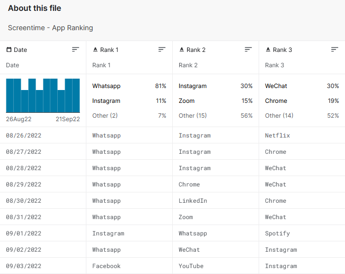

Alumno: Daniel Izquierdo Bonilla

# Pregunta 1

**1. Captura o recogida de datos: ¿Qué datos internos/externos se recogieron? ¿De quién? ¿Cuál era el objetivo de cada una de ellos?**

Se utilizaron los siguientes datos:

- Busquedas realizadas.
- Dispositivos utilizados.
- Dia preferido para el visionado.
- Tiempo empleado en la plataforma y en cada uno de los tipos de contenidos de la misma.
- Comprobar cuanto tiempo de dican a ver el capitulo, si lo dejan a medias etc.
- Las valoraciones de los consumidores.
- Preferencias en base a la zona geografica.
- Informacion de sus RRSS.

**2. Almacenamiento: ¿Cómo se guardarían los datos?**

Todos los datos son guardados tanto de forma física, ya sean discos HDD, SSD o en la nube en distintos servidores.

Dichos datos se almacenarían en formato CSV.

**3. Pre-procesado: Combinación de datos, selección, filtros...**

Todos los datos obtenidos han de ser organizados, en este caso se utilizan filtros como por ejemplo: de edad, region, generos más vistos, tanto actores como directores favoritos etc.

**4. Análisis: ¿Cuáles son los resultados y las conclusiones?**

El resultado de estos analisis es poder realizar una inversión a practicamente riesgo cero, ya que gracias a todos los datos obtenidos el producto que se ofrece 

**5. Visualización: ¿Qué visualizaciones podrían ser interesantes para tomar decisiones?**

Poder tener distintos gráficos que visualizar para comprimir toda la información de forma que sea sencilla la visualización de los mismos permitiendo que el tiempo destinado a la toma de decisiones sea menor y la decisión tomada sea la más óptima.

**6. Publicación (o distribución). ¿Se ejecutó alguna estrategia adicional relacionada con la ciencia de datos para maximizar el impacto o la distribución? Podéis pensar alguna más.**

Crearon 10 traillers con el fin de acercar la mayor audiencia posible a la serie, haciendo que cada uno de los trailers se asemejase al uso que hacian de la plataforma.

# Pregunta 2

**1. Buscad y seleccionad un portal que proporcione datos abiertos (una administración, una empresa, etc.).**

En https://www.kaggle.com/datasets podemos acceder al multitud de CSV's como por ejemplo el de la siguiente imagen:

**2. Explorad el contenido disponible. ¿Qué tipo de conjuntos de datos proporcionan? ¿Os parece que el contenido es fácilmente accesible (es decir, es fácil de utilizar)?**

Podemos filtrar las categorias de los distintos conjuntos de datos, visualizar en graficos los datos que nos proporcionan, descargar los distintos csv almacenados en la página etc.

Todo estos de una forma sencilla ya que unicamente requeriremos de una cuenta en Kaggle.

**3. Seleccionad uno de los conjuntos de datos disponibles del portal seleccionado, explicad su contenido concreto y pensad una aplicación práctica en la que puedan ser útiles.**

La imagen mostrada anteriormente nos permite ver de forma sencilla las 3 apps mas utilizadas y en que porcentaje, además de poder filtrar los datos.

Todos estos datos pueden ser usados por ejemplo para decidir que aplicación ee mejor para anunciar un producto.