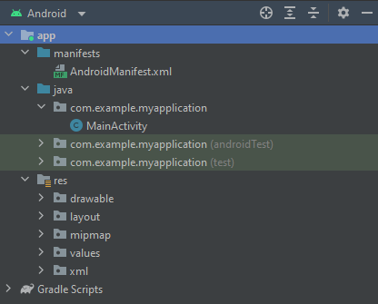
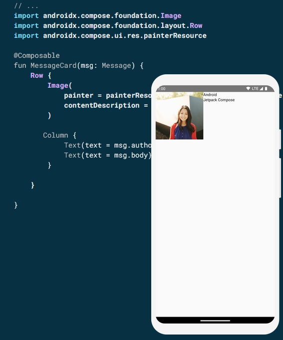

# **[Task 03] Ejercicio Investigación - Conceptos Básicos de Android**

## **Ejercicio 01**
### Investiga cómo funciona el sistema de archivos en Android Studio.
1. **¿Dónde se instala la Aplicación por defecto?**

Se instala en: C:\Program Files\Android\Android Studio

2. **¿Qué estructura de carpetas tiene? Explíca a grandes rasgos
qué contiene cada una de ellas, para qué sirven y la
funcionalidad de los principales “ficheros”.**

En el momento en el que creamos un nuevo proyecto nos aparecerá en el menú de la izquierda la estructura de carpetas.

Dentro de la carpeta app encontraremos todos los archivos necesarios para utilizar nuesta aplicación.

En la carpeta "manifest" encontraremos un archivo de configarción el cual contiene características de la misma.

Dentro de la carpeta "java" almacenaremos todo el código de nuesta aplicación.

La carpeta "res" está destinada a almacenar todos los recursos visuales que requiere nuestra aplicación.

3. **¿A qué carpetas tiene acceso el usuario?**

Esto depende de que vista del proyecto estemos usando, si usamos la vista de "Proyect" podremos acceder a todas las carpetas de nuestro proyecto, en cambio si usamos la vista "Android" solo veremos las carpetas mostradas en la imagen del punto anterior.

4. **¿Qué implicaciones tiene?**

Ocultar archivos críticos al usuario permite que la aplicación no se pueda romper por un cambio accidental del programador.

## **Ejercicio 02**
### JetpackCompose:
1. **¿Qué es y cuáles son sus objetivos?**

JetpackCompose es un framefork el cual permite diseñar interfaces mediante Kotlin con el fin de facilitar la programación de las mismas.

El objetivo de JetpackCompose es permitir desarollar elementos visuales más complejos ademas de permitir reutilzar vistas de forma sencilla y desarollar un codigo mas compacto a la hora de hacer tareas sencillas.

2. **A grandes rasgos, ¿cómo funciona? (principales
características)**

Como se puede ver en la imagen mostrada a continuación me diante el use del @Composable podemos 

3. **¿Cómo lo ves desde tu experiencia cómo programador?**

Partiendo de que no tengo experiencia con el desarrollo de interfaces no puedo opinar por experiencia propia, pero segun lo que he estado leyendo parece que es una forma muy eficiente de realizar interfaces. He visto comentarios de otros programadores que para por ejemplo, hacer un botón se han usado hasta 10 veces menos código, lo cual indica su alta eficiencia.

### Bibliografía

https://developer.android.com/jetpack/compose?hl=es-419/

https://www.develou.com/android-studio-proyecto-en/