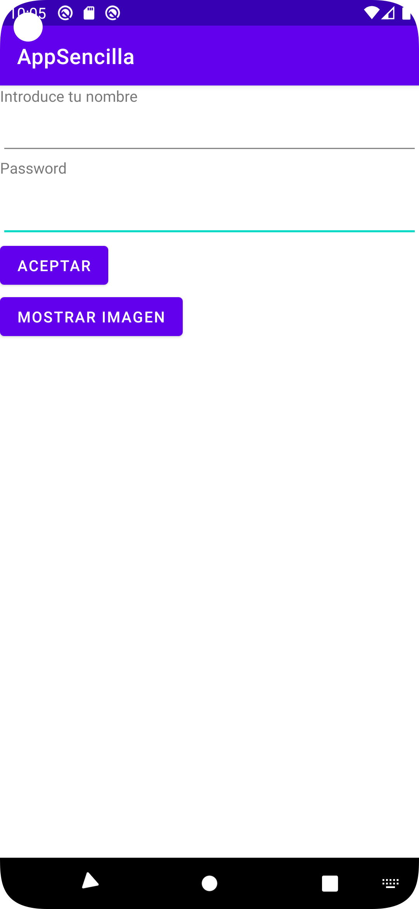

# **[Task 04] App sencilla**

## ¿Que realiza la aplicación?

La aplicacion permite ingresar un nombre y una contraseña, siendo el campo contraseña de tipo textPassword y cuando clickemos en el boton "Aceptar" nos mandará a la Activity "SaludoActivity" la cual nos muestra los datos introducidos en la "MainActivity". Además tenemos un botón "Mostrar Imagen" el cual nos muestra una imagen y cambia el texto del botón a "Oculatar Imagen" para que cuando volvamos a dar en el botón oculte la imagen.

## Codigo de la app

MainActivity:

```kotlin
package com.example.appsencilla

import android.content.Intent
import androidx.appcompat.app.AppCompatActivity
import android.os.Bundle
import android.view.View
import android.widget.Button
import android.widget.EditText
import android.widget.ImageView

class MainActivity : AppCompatActivity() {
    private lateinit var txtNombre : EditText
    private lateinit var txtPass : EditText
    private lateinit var imagen : ImageView
    
    override fun onCreate(savedInstanceState: Bundle?) {
        super.onCreate(savedInstanceState)
        setContentView(R.layout.activity_main)

        //Obtenemos una referencia a los controles de la interfaz
        txtNombre = findViewById(R.id.txtNombre)
        txtPass = findViewById(R.id.editTextTextPassword)
        imagen = findViewById(R.id.imageView)
        imagen.setImageResource(R.drawable.shk)
    }

    fun aceptar(view: View) {
        val intent = Intent(this@MainActivity, SaludoActivity::class.java)
        //Añadimos al intent la información a pasar entre actividades
        intent.putExtra("NOMBRE", txtNombre.text.toString())
        intent.putExtra("PASS", txtPass.text.toString())
        //Iniciamos la nueva actividad
        startActivity(intent)
    }

    fun mostrarImagen(view: View) {
        val btnMostrarImagen : Button  = findViewById(R.id.btnMostrarImagen)

        if (imagen.visibility == View.INVISIBLE) {
            imagen.visibility = View.VISIBLE
            btnMostrarImagen.text = "Ocultar imagen"
        } else
        {
            imagen.visibility = View.INVISIBLE
            btnMostrarImagen.text = "Mostrar imagen"
        }

    }
}
```

SaludoActivity:
```kotlin
package com.example.appsencilla

import android.os.Bundle
import android.widget.TextView
import androidx.appcompat.app.AppCompatActivity

class SaludoActivity : AppCompatActivity() {
    private lateinit var txtSaludo : TextView
    
    override fun onCreate(savedInstanceState: Bundle?) {
        super.onCreate(savedInstanceState)
        setContentView(R.layout.activity_saludo)

        //Obtenemos una referencia a los controles de la interfaz
        txtSaludo = findViewById(R.id.txtSaludo)
        //Recuperamos la información pasada en el intent
        val nombre = intent.getStringExtra("NOMBRE")
        val pass = intent.getStringExtra("PASS")
        //Construimos el mensaje a mostrar
        txtSaludo.text = "Hola $nombre, tu password es $pass"
    }
}
```

## Código de los XML

En el activity_main.xml he añadido un TextView, el cual muestra "Password", un EditText en el cual se introduce la password de forma que se oculte a medida que los escribimos, un Button que está asociado a la función "mostrarImagen" y un ImageView el cual llama a la imagen almacenada en la carpeta "drawable"

```xml
<?xml version="1.0" encoding="utf-8"?>
<LinearLayout xmlns:android="http://schemas.android.com/apk/res/android"
    xmlns:app="http://schemas.android.com/apk/res-auto"
    xmlns:tools="http://schemas.android.com/tools"
    android:id="@+id/lytContenedor"
    android:layout_width="match_parent"
    android:layout_height="match_parent"
    android:orientation="vertical" >
    <TextView android:id="@+id/lblNombre"
        android:layout_width="wrap_content"
        android:layout_height="wrap_content"
        android:text="@string/nombre" />

    <EditText
        android:id="@+id/txtNombre"
        android:layout_width="match_parent"
        android:layout_height="wrap_content"
        android:inputType="text"
        android:minHeight="48dp"
        tools:ignore="SpeakableTextPresentCheck" />

    <TextView
        android:id="@+id/passwd"
        android:layout_width="match_parent"
        android:layout_height="29dp"
        android:text="@string/password" />

    <EditText
        android:id="@+id/editTextTextPassword"
        android:layout_width="match_parent"
        android:layout_height="wrap_content"
        android:ems="10"
        android:inputType="textPassword"
        android:minHeight="48dp"
        tools:ignore="SpeakableTextPresentCheck" />

    <Button android:id="@+id/btnAceptar"
        android:layout_width="wrap_content"
        android:layout_height="wrap_content"
        android:text="@string/aceptar"
        android:onClick="aceptar"
        />

    <Button
        android:id="@+id/btnMostrarImagen"
        android:layout_width="wrap_content"
        android:layout_height="wrap_content"
        android:onClick="mostrarImagen"
        android:text="@string/mostrarImagen" />

    <ImageView
        android:id="@+id/imageView"
        android:layout_width="wrap_content"
        android:layout_height="wrap_content"
        android:visibility="invisible"
        app:layout_constraintBottom_toTopOf="@+id/textView"
        app:layout_constraintEnd_toEndOf="parent"
        app:layout_constraintHorizontal_bias="0.0"
        app:layout_constraintStart_toStartOf="parent"
        app:layout_constraintTop_toTopOf="parent"
        app:srcCompat="@drawable/shk" />

</LinearLayout>
```

En el activity_saludo.xml tenemos un TextView el cual muestra el los datos pasados desde el MainActivity.

```xml
<?xml version="1.0" encoding="utf-8"?>
<LinearLayout xmlns:android="http://schemas.android.com/apk/res/android"
    android:id="@+id/lytContenedorSaludo"
    android:layout_width="match_parent"
    android:layout_height="match_parent"
    android:orientation="vertical" >

    <TextView android:id="@+id/txtSaludo"
        android:layout_width="wrap_content"
        android:layout_height="wrap_content"
        android:text="" />

</LinearLayout>
```

## Muestra de la aplicación

Captura de la aplicación



## Link al repositorio de GitHub

https://github.com/danizq303/AppSencilla