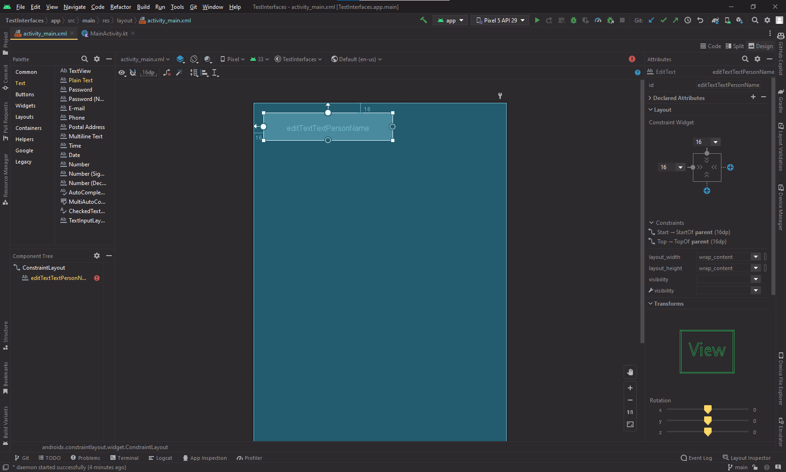
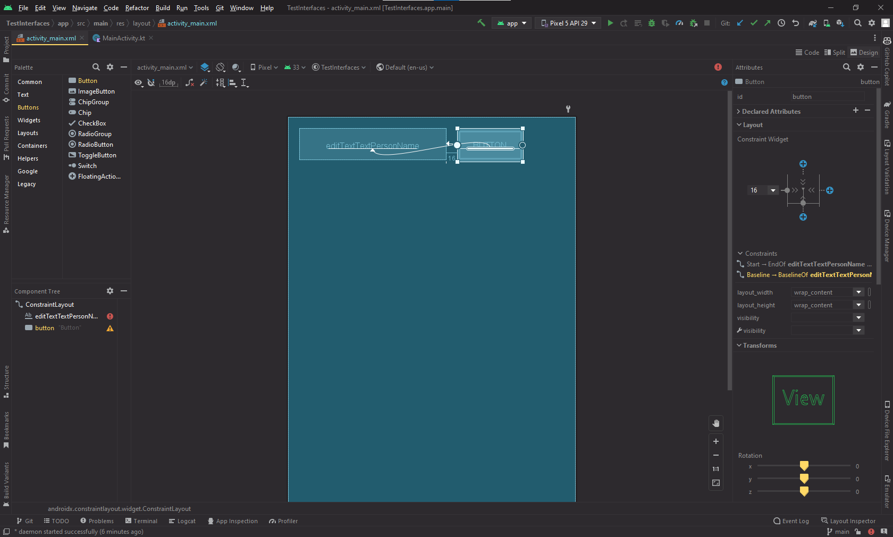
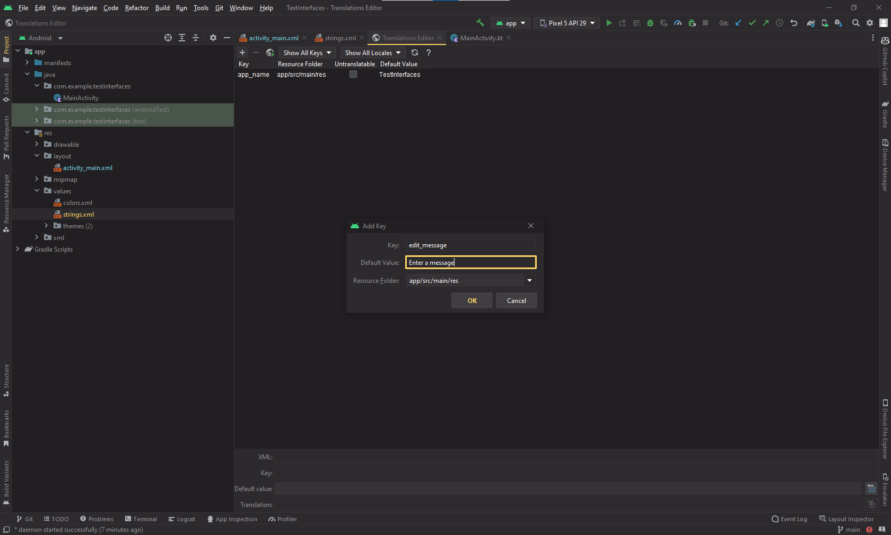
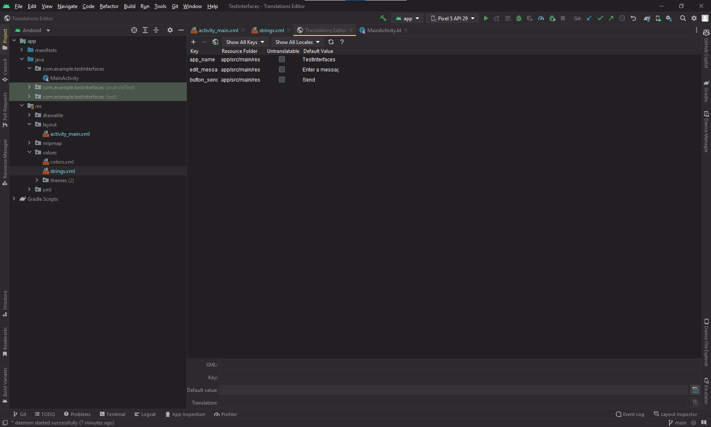
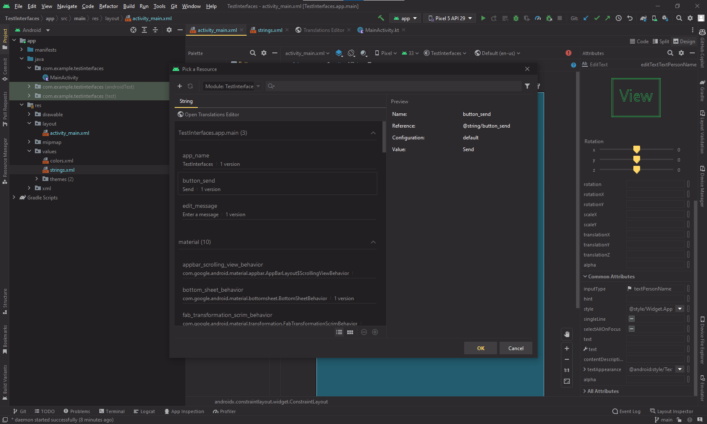
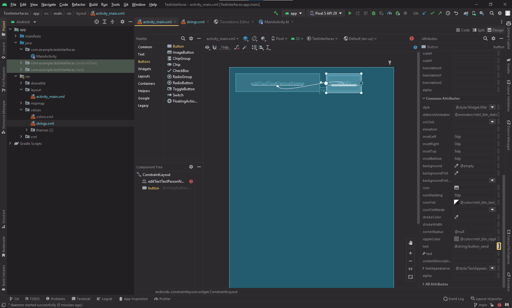
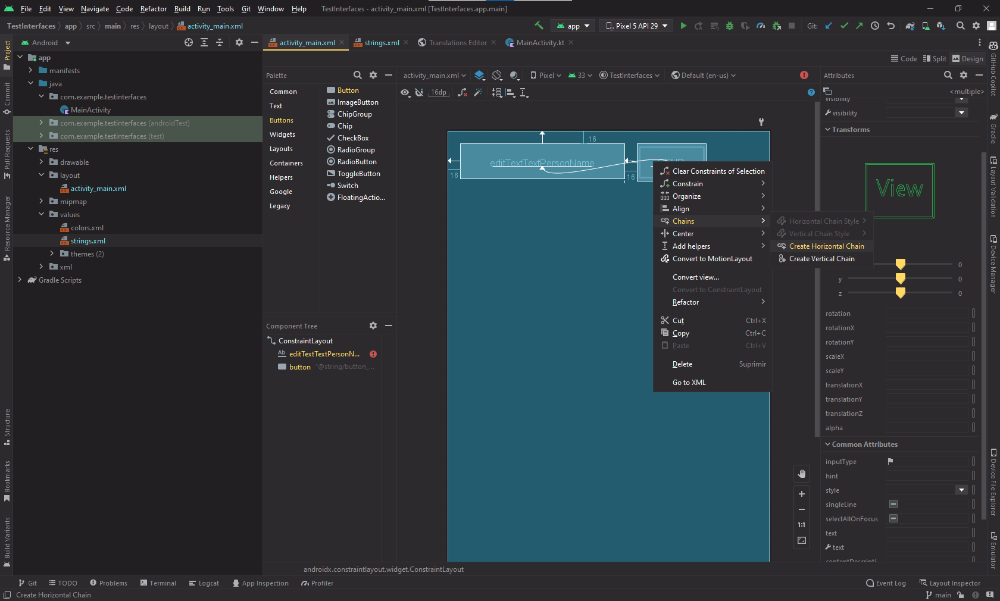
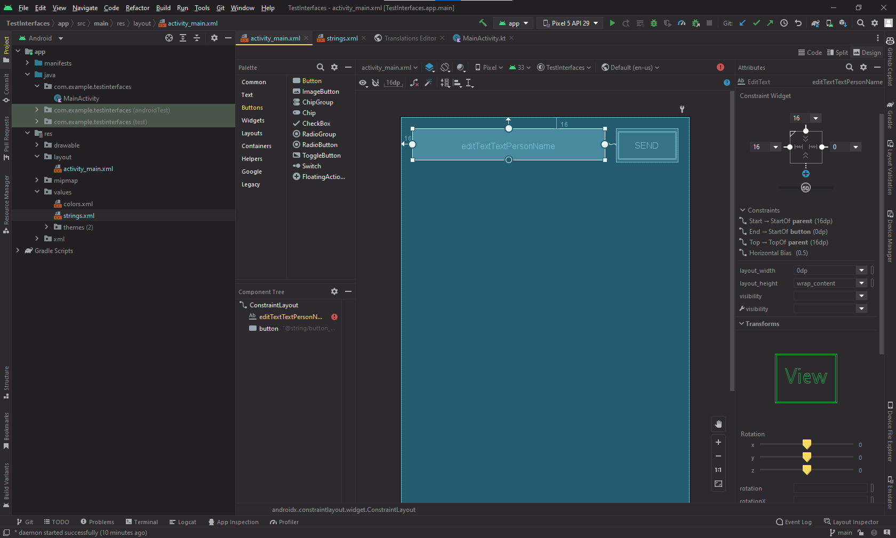
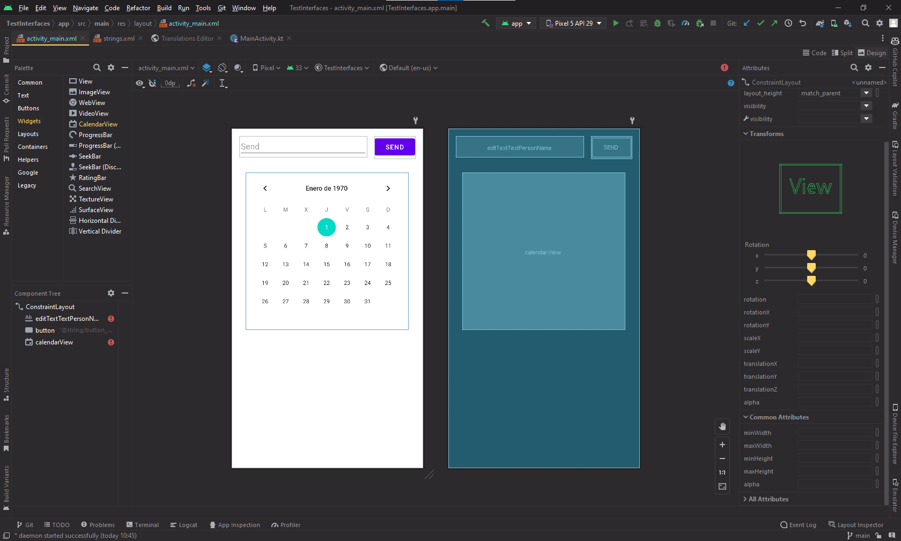
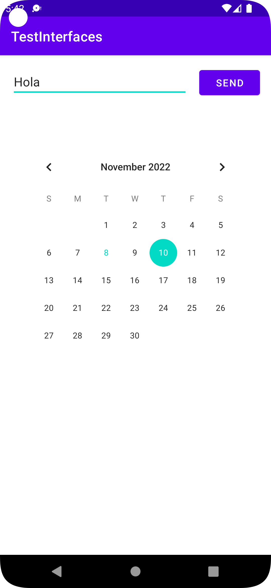

# **[Task 05] Interfaz sencilla**

## Crear Interfaz

Creamos un EditText el al que le pondremos un margen de 16dp tanto en la parte superior como en la izquierda.

A continuación añadiremos un botón el cual anclaremos al EditText y además alinearemos el boton con el EditText.

Dentro del archivo strings.xml abriremos el editor, le daremos al '+' y rellenaremos el campo con el key y el valor por defecto.

Haremos lo mismo para añadir los valores que queremos para el botón.

En el archivo activity_main.xml seleccionaremos el EditText y en el menu de "Attributes", el cual aparece a la derecha borraremos los datos que contiene el campo "text", además le daremos al botón que aparece a la derecha del campo "hint" y en el menú que aparece en la imagen seleccionaremos el texto que le corresponde.

Seleccionaremos el botón y en el apartado de text le daremos al botón y seleecionaremos el texto que le corresponde.

Seleccionaremos ambos elemntos, le daremos click derecho y en el menu que aparece le daremos a "Create Vertical Chain".

Desde el menú de Constraint Widget añadiremos un padding de 16dp al margen derecho y clicaremos en el indicador de ancho dos veces para cambiar a Match Constraint. 

## Modificaciones Realizadas

He añadido un calendario debajo de los elemento añadidos anteriormente el cual tiene un margen superior de 64dp y 30dp de izquierdo y derecho.

## Link GitHub

https://github.com/danizq303/TestInterfaces