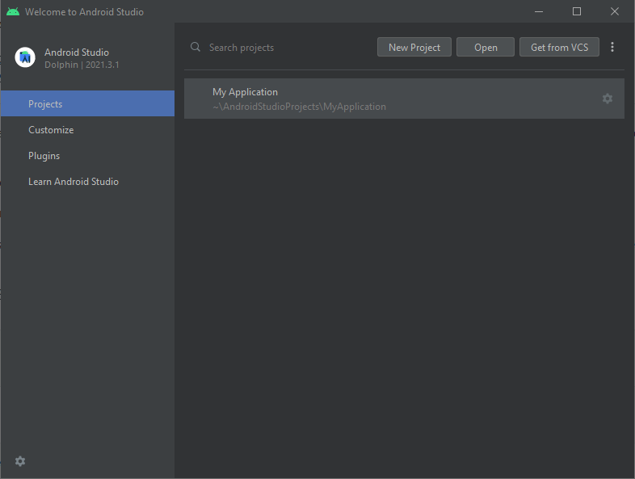
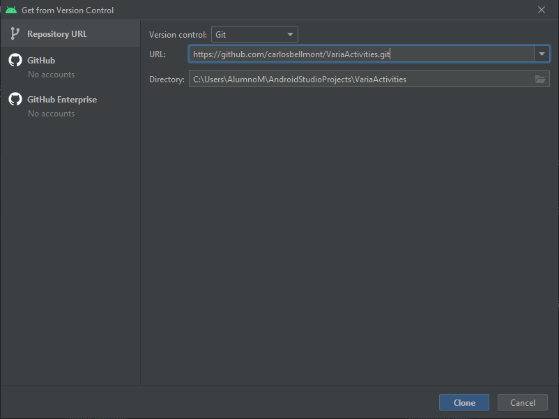
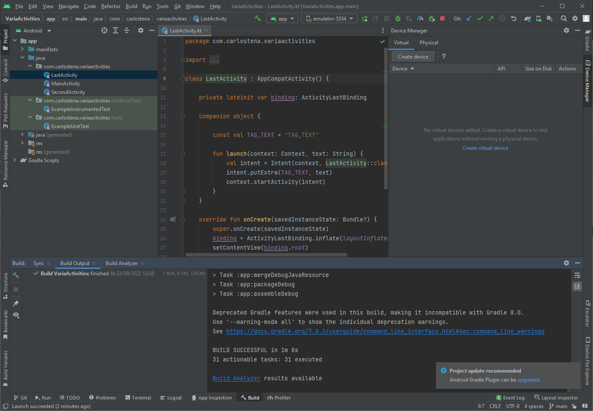
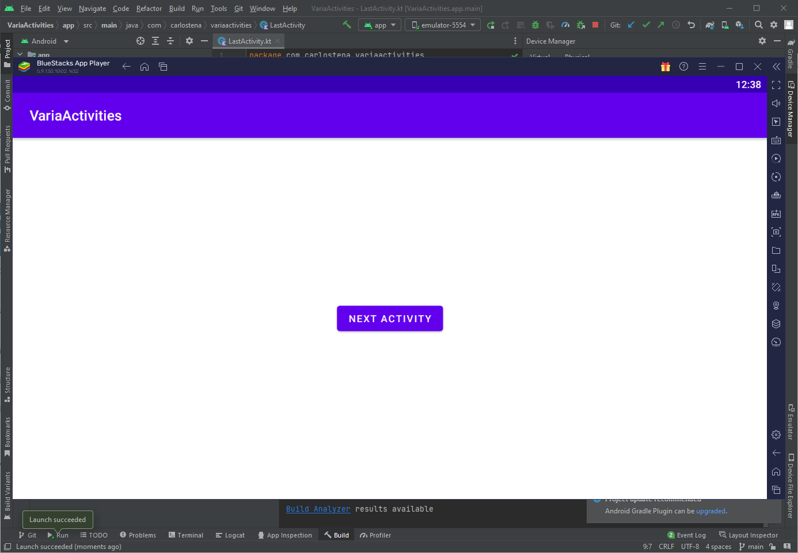

# [Task 02] Android Studio - Instalación y configuración

Alumno: Daniel Izquierdo Bonilla

## Instalacion Android Studio y Configuracion
- Abriremos el instalador.


- Le daremos a siguiente hasta llegar a la siguiente pantalla.


- Le daremos a "Install"

- Abriremos Android Studio y le daremos a Next.


- Seleccionaremos "Standard" y le daremos a Next.


- Seleccionaremos el tema que prefiramos y le daremos a Next.


- Le daremos a Next.


- Aceptaremos los acuerdos de licencia y le daremos a Finish.


- Le daremos a Finish.


- Abriremos Android Studio

- Seleccionaremos "Customize"


- Iremos al menu de Buld, Execution, Deployment -> Compiler y marcaremos la opcion mostrada. (Sirve para maximizar todos los recursos y disponibles y así maximizar el rendimiento de Android Studio).


- Iremos al menu de Editor -> File Types y en la opcion de "Ignored Files and Folders" añadiremos "thumbs.db". (Esto sirve para elminar las imágenes en caché de nuestro proyecto).


- Iremos al menu de Appearence & Behavior -> System Setting -> Memory Settings y cambiaremos la memoria que dedicamos al IDE a 4096. (La finalidad de esta configuración es permitir a Android Studio usar hasta 4096MB de ram).


- Le daremos a aplicar y en la ventana que nos aparezca le daremos a Yes.


- Le daremos a la rueda de abajo a la izquierda y seleccionaremos "Edit Custom VM Options".


- Escribiremos los siguientes parametros.
```
-Xmx8192
-Xms4096
```
El comando xmx es el maximo de ram que se destinará a Android Studio y el xms el minimo de ram reservada para Android Studio.


## Instalacion Bluestacks y Configuracion
- Seleccionaremos "Instalar Ahora".


- Abriremos Ajustes -> Avanzado y activaremos el puente ADB. (El objetivo de esto es poder ejecutar las aplicaciones de Android Studio a través de BlueStacks).


## Integrar Android Studio con Git
- En el menu de inicio le daremos a Get from VCS.



- Pegaremos la url del repositorio y le daremos a "Clone".



- Automaticamente nos cargará el proyecto que hemos clonado.



- Prueba de que el proyecto se ha ejecutrado correctamente.

