# [Task 02] Android Studio - Instalación y configuración

Alumno: Daniel Izquierdo Bonilla

## Instalacion Android Studio
- Abriremos el instalador.
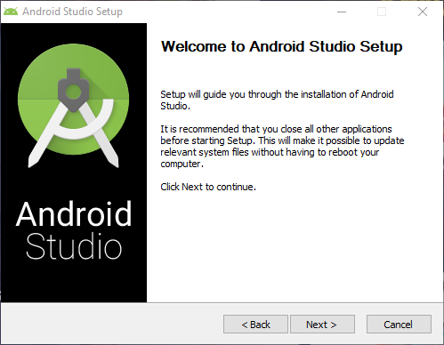

- Le daremos a siguiente hasta llegar a la siguiente pantalla.
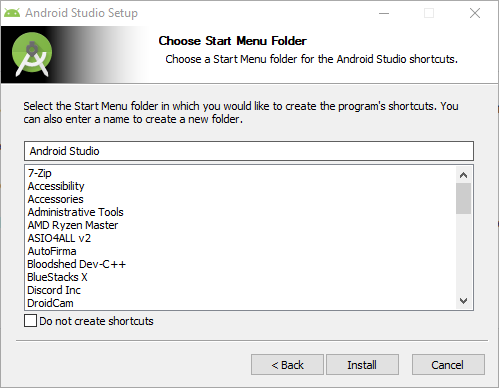

- Le daremos a "Install"

## Configuracion Android Studio
- Abriremos Android Studio y le daremos a Next.
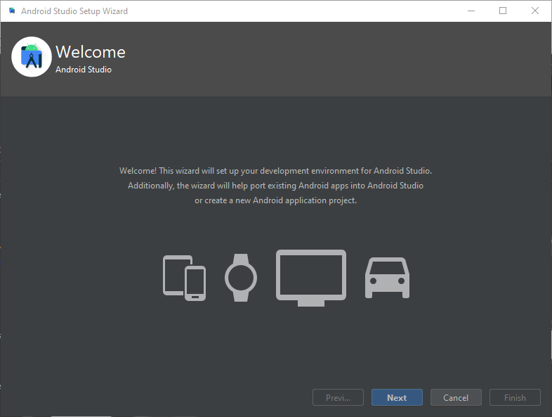

- Seleccionaremos "Standard" y le daremos a Next.
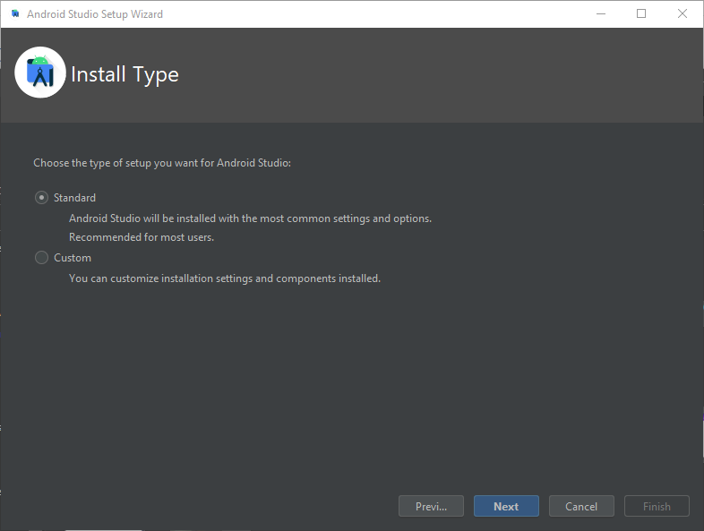

- Seleccionaremos el tema que prefiramos y le daremos a Next.
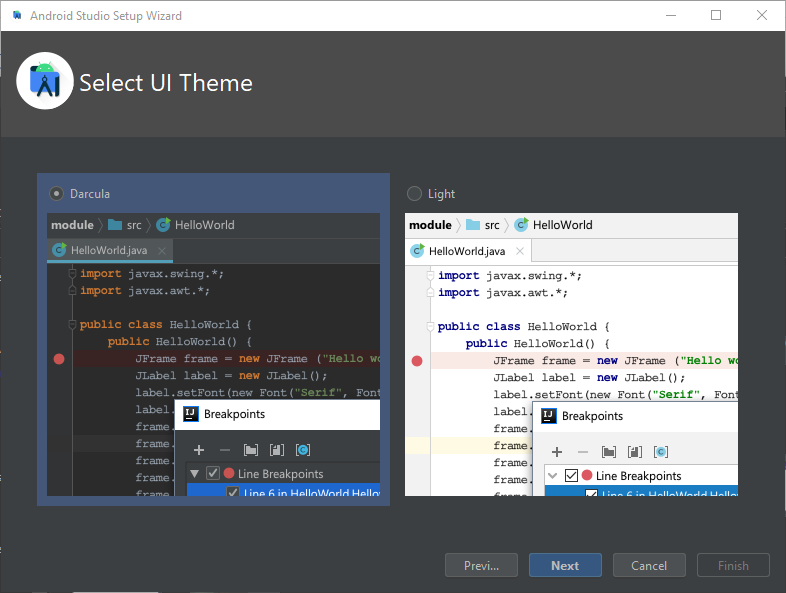

- Le daremos a Next.
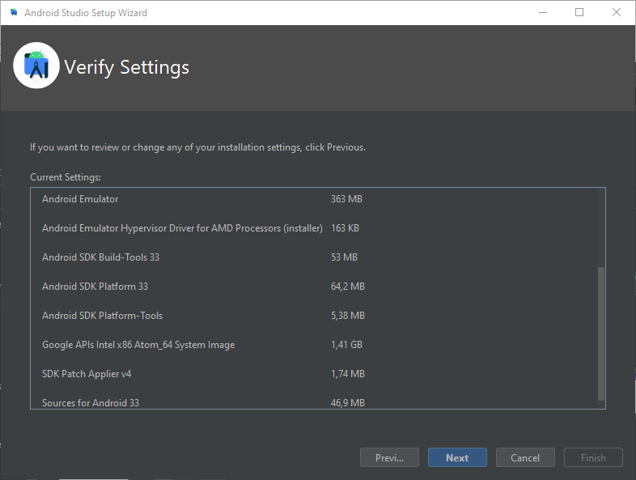

- Aceptaremos los acuerdos de licencia y le daremos a Finish.
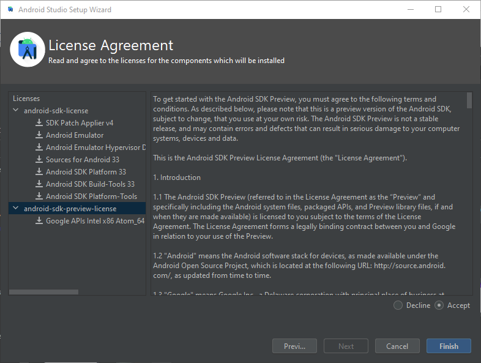

- Le daremos a Finish.
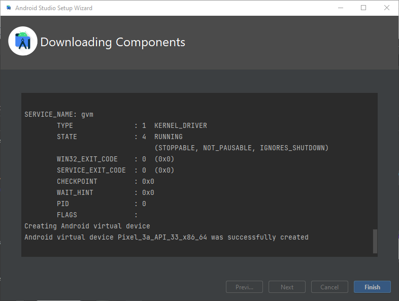

- Abriremos Android Studio

- Seleccionaremos "Customize"
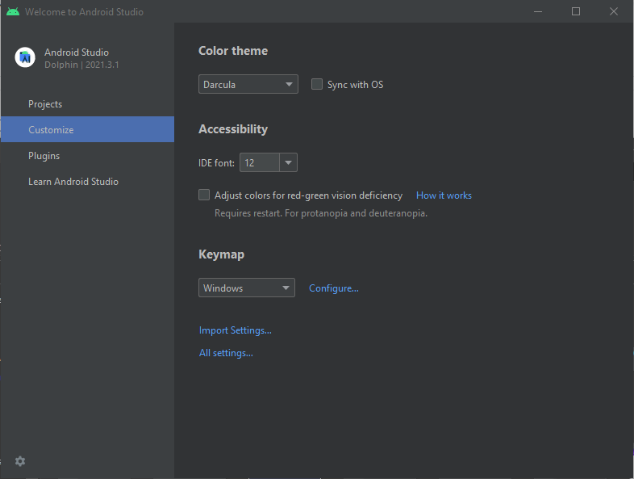

- Iremos al menu de Buld, Execution, Deployment -> Compiler y marcaremos la opcion mostrada.
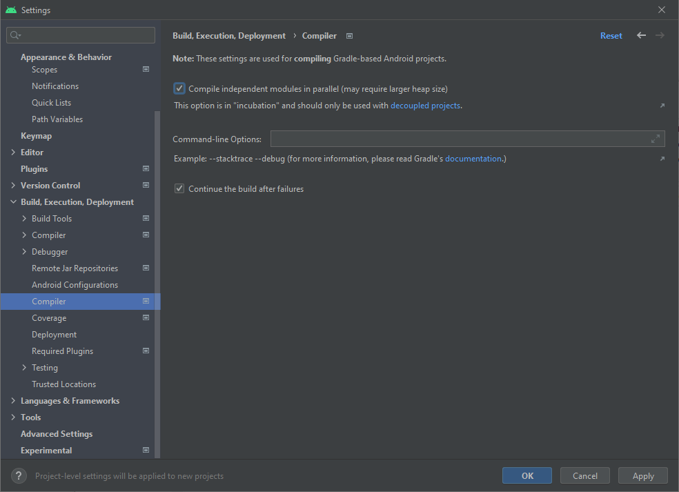

- Iremos al menu de Editor -> File Types y en la opcion de "Ignored Files and Folders" añadiremos "thumbs.db".
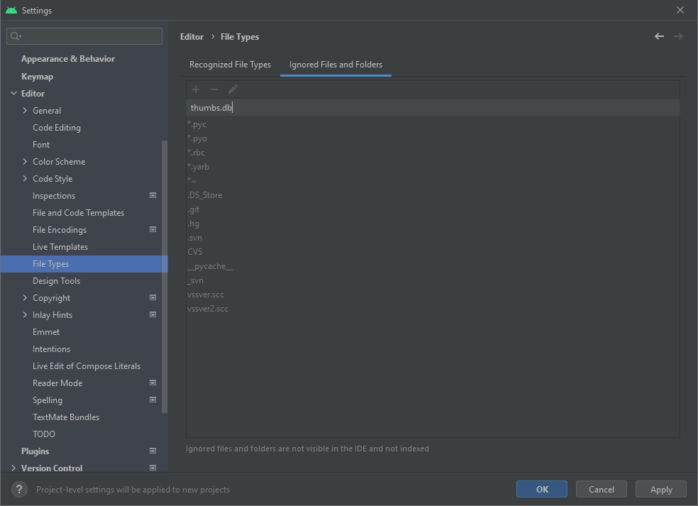

- Iremos al menu de Appearence & Behavior -> System Setting -> Memory Settings y cambiaremos la memoria que dedicamos al IDE a 4096.
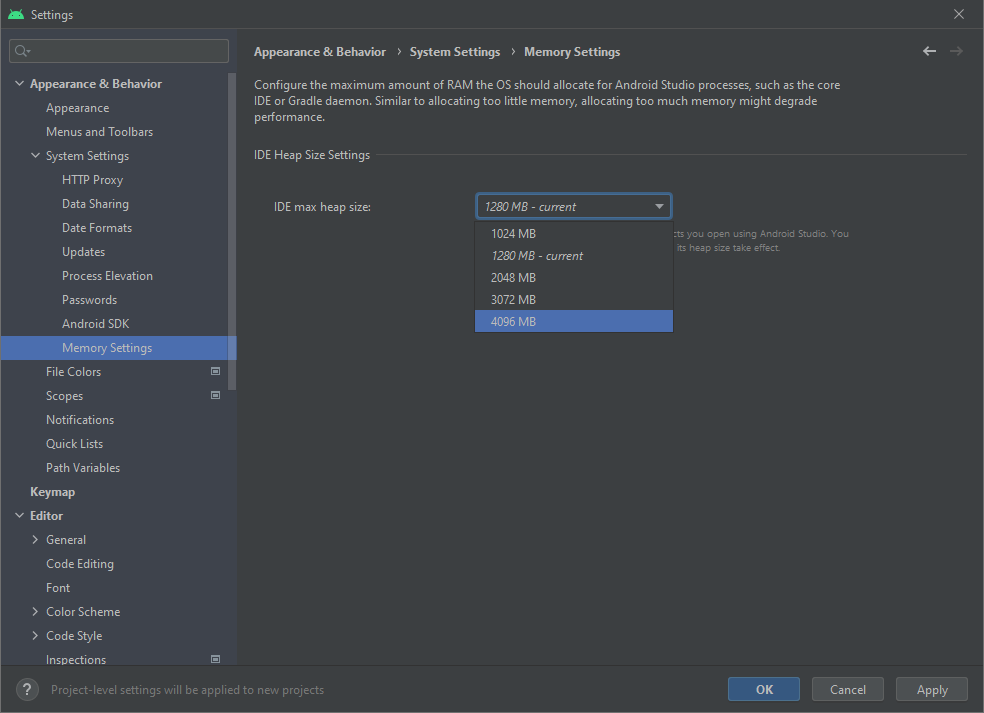

- Le daremos a aplicar y en la ventana que nos aparezca le daremos a Yes.
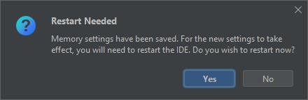

- Le daremos a la rueda de abajo a la izquierda y seleccionaremos "Edit Custom VM Options".
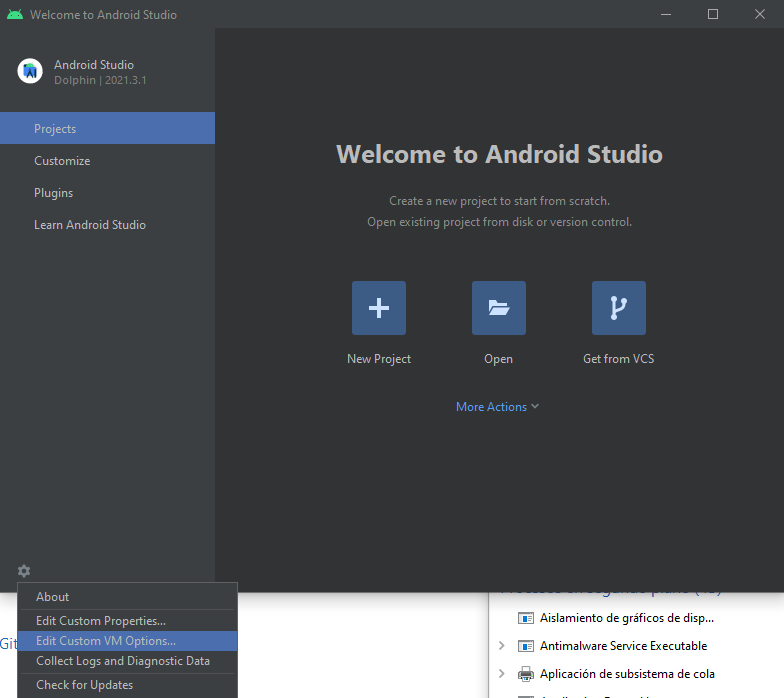

- Escribiremos los siguientes parametros.
```
-Xmx8192
-Xms4096
```
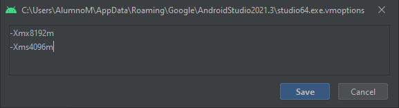

## Instalacion Bluestacks
- Seleccionaremos "Instalar Ahora".
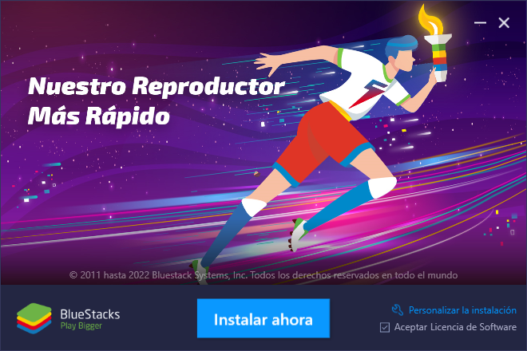

- Abriremos Ajustes -> Avanzado y activaremos el puente ADB.
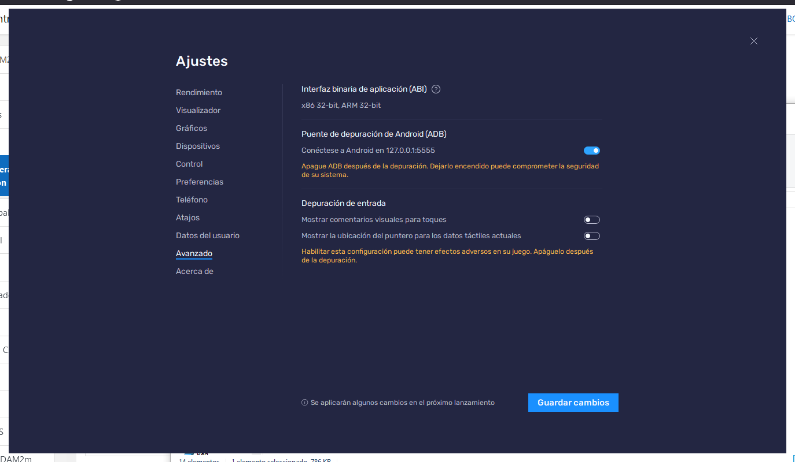