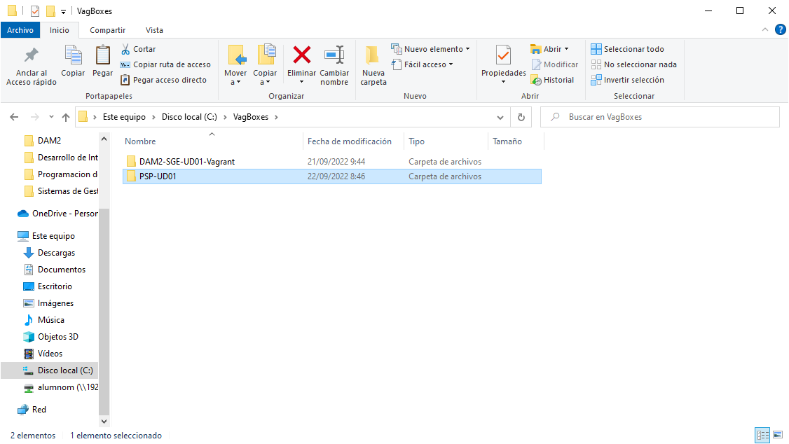
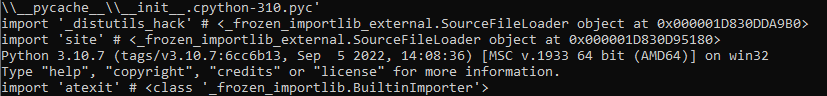
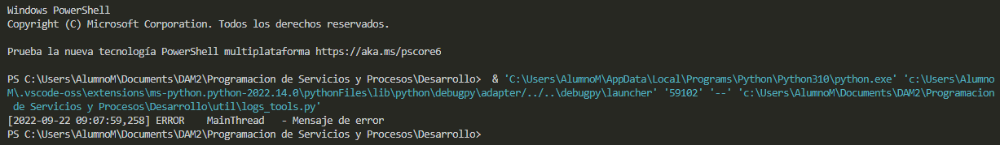

# Identificación:

Alumno: Daniel Izquierdo Bonilla

Ciclo: DAM2

Centro Educativo: CES Afuera

# Objeto

Documentar la práctica 1 de la UD01 del módulo PSP de comparación de requisitos multitarea

# Ámbito

Evaluación continua del módulo DAM2-PSP en el CES Afuera (curso 22-23)

# Siglas

Si se utilizan siglas en el texto

# Enunciado

- Enumerar los pre-requisitos necesarios para la práctica (por ejemplo: hw: ordenador con una configuración similar a la de clase, sw: sistema operativo, vagrant, virtualbox, VSCodium) (1 punto)

- Instalar los ficheros que definen la máquina virtual en el directorio adecuado (se sugiere que, si es en Windows, estén en c:\VagBoxes\PSP-UD01. (1 punto)

- Arranque de la máquina virtual (1 punto)

- Instalar el software Python en un directorio adecuado. Este software no debería colgar de VagBoxes, se sugiere que esté en la carpeta Desarrollo\PSP\ del directorio de usuario (1 punto)

- Probar el programa util\logs-tools.py. Probablemente haya que instalar bibliotecas adicionales (2 puntos)

- Probar el programa PSP-UD01\compare_multitask_types.py. Indicar qué procedimiento es el más rápido y cuál el más lento (2 puntos)

- Documentar el proceso de una forma sencilla, clara y limpia. Se sugiere, aunque en esta práctica, por haber empezado antes de su formalización como tarea, no se exiga, que se realice en formato markdown con la siguiente estructura (2 puntos)


# Resolución

## Prerrequisitos

Requisitos Hardware: Procesador con al menos 4 nucleos, 8GB de RAM, Disco duro con 50GB.

Requisitos Software: Sistema Operativo Windows, VirtualBox, Vagrant, VSCodium y Python.

## Instalación de ficheros de la máquina virtual

Copiaremos la maquina a: ```C:\VagBoxes```



## Arranque de la máquina virtual

Arrancaremos la maquina con: ```vagrant up```


## Instalación de SW Python para pruebas

Ejecutamos el comando ```python -v```



## Probar el programa util\logs-tools.py

Ejecutaremos el script en VSCodium mediante la tecla F5:



## Probar el software compare_multitask_types.py

Ejecutaremos el script en VSCodium, para que no de error deberemos instalar los modulos faltantes:

```cmd
pip install requests
pip install aiohttp
```

Primer tipo:

```log
[2022-09-22 09:15:14,392] INFO     MainThread   - Completada (monotarea) in 40.90244817733765

[2022-09-22 09:15:31,983] INFO     MainThread   - Completadas (<class 'concurrent.futures.process.ProcessPoolExecutor'>) en 17.590238332748413

[2022-09-22 09:16:04,128] INFO     MainThread   - Completadas (<class 'concurrent.futures.thread.ThreadPoolExecutor'>) en 32.141475439071655

[2022-09-22 09:16:17,104] INFO     MainThread   - Completadas (aiohttp) en 12.973133087158203
```

Segun los resultado optenidos la "Co-rutina" seria lo más rápido seguido de los "Procesos", los "Hilos" y la "Monotarea"