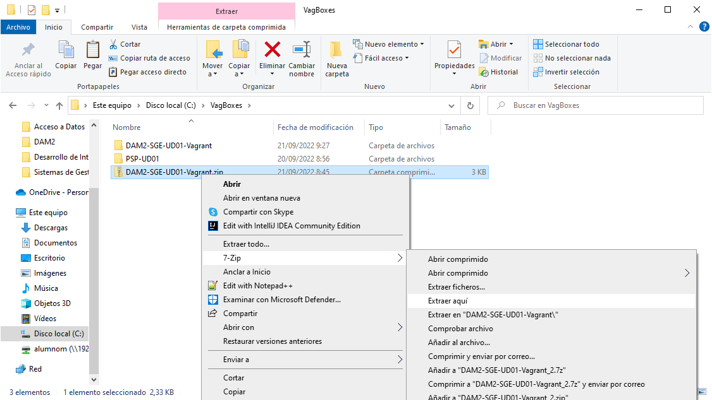

# Identificación:

Alumno: Daniel Izquierdo Bonilla

Ciclo: DAM2

Centro Educativo: CES Afuera

# Objeto

Documentar la práctica 1 de la UD01 del módulo SGE relativa a la instalación de Odoo

# Ámbito

Evaluación continua del módulo DAM2-SGE en el CES Afuera (curso 22-23)

# Siglas

Si se utilizan siglas en el texto

# Enunciado

La presente práctica tiene por objeto la instalación de Odoo a partir de la especificación Vagrant proporcionada

Las tareas a realizar son:

    Enumerar los prerrequisitos hw y sw (2 punto)
    Descomprimir los ficheros adjuntos en c:\VagBoxes\SGE-UD01 (2 puntos)
    Arranque de la máquina virtual (2 puntos)
    Prueba del resultado con un navegador accediendo a http://192.168.56.202:8069 (2 puntos)
    El resultado se deberá documentar en un fichero markdown (2 puntos) con la siguiente estructura


# Resolución

## Prerrequisitos

Hardware:

Ordenador con al menos 4 nucleos, 4GB de RAM y 20GB de disco duro

Software:

Windows 10 y tener VirtualBox y Vagrant instalado

## Instalación de ficheros de la máquina virtual

Copiaremos el archivo .zip adjuntado en la practica en c:\VagBoxes. A continuacion lo descompriremos en dicha ruta.



## Arranque de la máquina virtual

Abriremos un terminal dentro de la carpeta y levantaremos la maquina:

```
    vagrant up
```

## Pruebas

Cuarto punto de la práctica